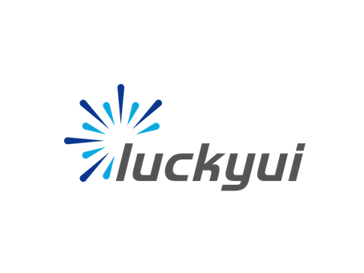

    

    

一个基于Django的工具包，集成了各种在商业化项目中需要用到的通用功能。LuckyUI包含了Django和UniApp两个部分，此项目是Django部分，这里称为Django-LuckyUI。

> ！！！Django-LuckyUI是基于Django和SimpleUI的扩展开发项目，如果本项目对您提供了帮助，请同时了解并关注它们。

- Django
  是一个非常优秀的Python项目。它提供了一个高度集成的软件工具包，实现了通用场景Web应用功能，能够让各种业务场景避开繁琐的底层通用功能直接开发业务功能，让商业项目快速落地，有效降低企业（特别是初创企业）的新项目试错成本。
- SimpleUI 是一个非常优秀的Django主题项目。它集成了ElementUI并改进了Django自带的ModelAdmin，本项目基于SimpleUI进一步扩展，以期达到真正开箱即用，让项目人员专注业务功能实现的目的。

> 项目演示地址：还没上线呀\
> 账号：lucky\
> 密码：12345678\
> ！！！演示数据每天都会重置。

项目文档：[LuckyUI](https://www.yuque.com/luckyliu-hofp4/django-luckyui)

交流社区：基本不用QQ，只有微信群，先加我，备注Django-LuckyUI，我在拉你进群。

项目赞助💰：不需要赞助，如果你有好玩，通用场景非常好的需求，提给我们，就是对这个项目的赞助。👉 你提需求，我来开发

外包/广告：不接！不接！不接！如果是基于Django方面的技术咨询，接！接！接！其它的勿扰！！！

依赖项目：

关于我们：元始开源小组 为了建设一个基于Python生态圈，更低成本更高效率的可支持开展商业化项目的开源社区。